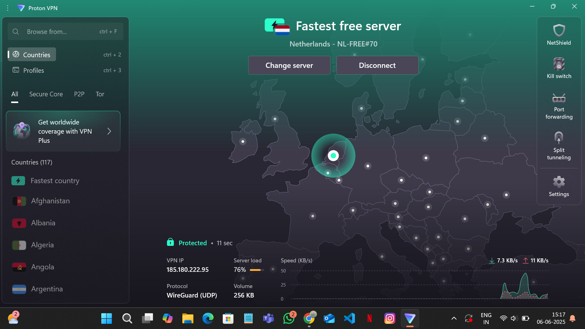
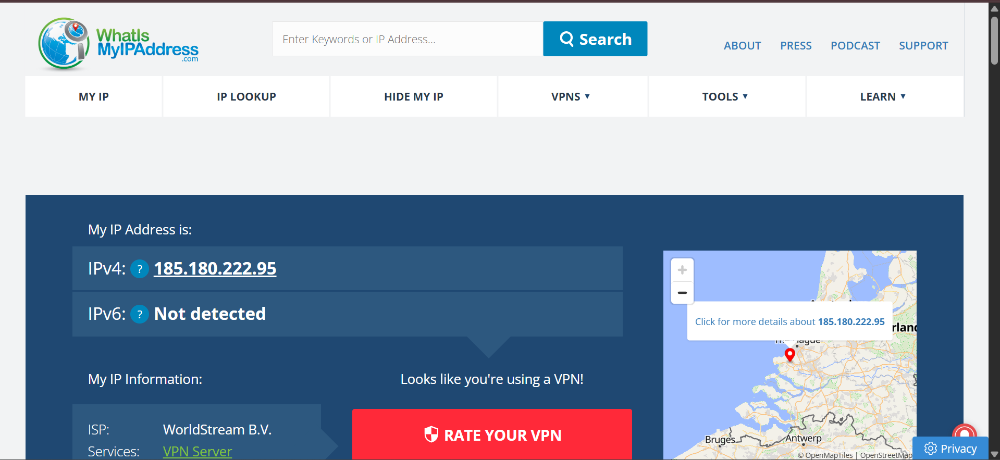
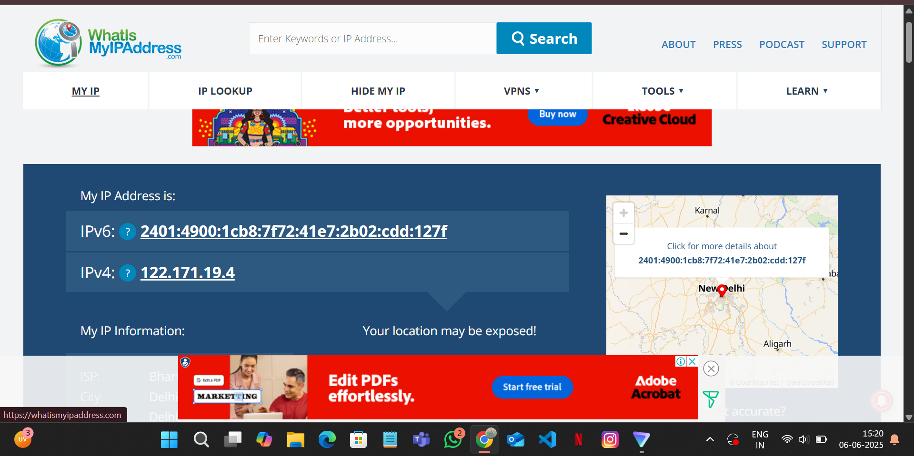

# VPN Setup and Testing Report

## Objective
Understanding VPN role in privacy protection and secure communication.

## Tools Used
- **VPN Client**: ProtonVPN (Free Tier)
- **IP Checker**: whatismyipaddress.com

## Steps Completed

### 1. VPN Setup
- Installed ProtonVPN client
- Connected to Netherlands server (NL-FREE#70)
- Protocol: WireGuard (UDP)

*Screenshot: ProtonVPN successfully connected to Netherlands server*

### 2. IP Verification

**With VPN:**
- IP: 185.180.222.95
- Location: Netherlands
- ISP: WorldStream B.V.

*Screenshot: IP address showing Netherlands location while VPN is active*

**Without VPN:**
- IP: 122.171.19.4
- Location: New Delhi, India

*Screenshot: Real IP address showing New Delhi location after VPN disconnect*

### 3. Website Testing
- Successfully browsed websites with encrypted connection
- Verified secure connection (HTTPS padlock)

*Screenshot: Successful website browsing with VPN connection and secure HTTPS*

## Key Findings

### VPN Benefits
-  Hides real IP address and location
-  Encrypts internet traffic
-  Protects privacy online
-  Secure browsing on public networks

### VPN Limitations
-  Slower connection speeds
-  Limited free server options
-  Some websites detect/block VPN traffic
-  Data usage restrictions on free plans

## Conclusion
VPN successfully masks IP address and encrypts traffic, providing privacy protection with trade-offs in speed and accessibility.
